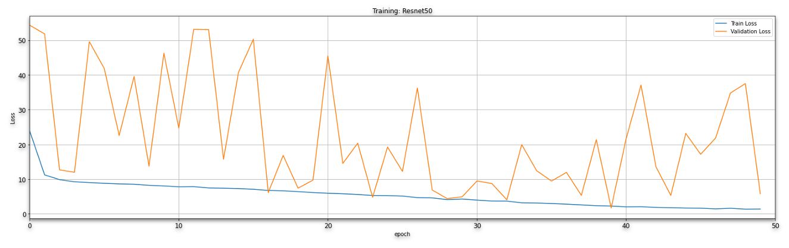
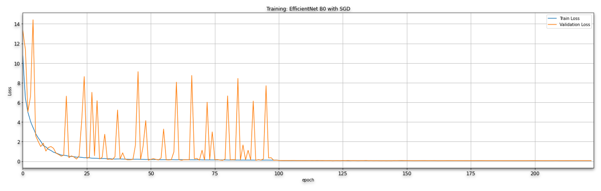
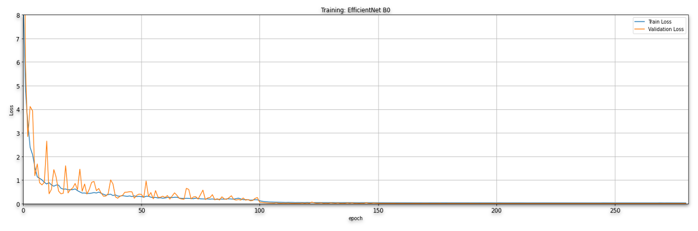

# DLS-Project
Deep Learning Systems Final Project

# Implementation

In this repository, we store the code for our Deep Learning Systems Project. In this project we try to estimate the velocity of a vehicle from a single camera from inside the car. 

## Requirements

We can run the program in this repo using python 3. 
The requirements are only: 
```
torch==1.9.0
torchvision==0.10.0
imageio==2.8.0
opencv-python
```

## Data

We got the data from the [speed challenge](https://github.com/commaai/speedchallenge) which was a competition held by comma.ai in 2017. This data can be found the comma.ai repo. The format is supposed to mp4 files.
One for testing and the other for training. To be able to run the scripts in this repo, you must first download the video files from the comma.ai repo. 

In the image below, we can see a section of the training video.


### Optical Flow
We used optical flow to capture the movement between frames. Optical Flow can be defined as the distribution of apparent velocities of movement of brightness pattern in an image. We used OpenCV to calculate the optical flow.
The algorithm that we employed is the Farneback method. This method computes the Dense optical flow. That means it computes the optical flow from each pixel point in the current image to each pixel point in the next image.

After computing the optical flow, the results look like this:


## Project Structure

The structure of our project is very simple. We have a directory called `data` containing the data provided to us from the comma.ai competition. This includes the label files, as well as the videos for training and the video for testing. Unfortunately, we were unable to add the video files to github because of the size of the files, and github's size restrictions. 

The `efficient_pytorch` directory contains the implementation of efficientNet. For this project, we decided to use the B0 version of the network. 
The architecture of this model is shown in the image blow. 

The script `video-to-frame.py` was used to process that video files and produce the dataset that we used to train our models. 

`train_model.py` and `trainer.py` are maybe the most important script. They were used to train the models. More information about how to run all these scripts will be provided below. 

The `images` directory, contains images that are being used in this readme file. 

The `scripts` directory contains the scripts that were used to train our models in HPC

## How To Run: Training Script

We can run the training script like so: 
``python train_model.py --dataset_mode of --dataset ./regular_frames --model efficientnet --batch 64 --save_path ./results --epoch 100 --lr 0.01``

For more information about the `train_model.py` use -h or --help. If we use this flag, we get the following output: 

```
usage: train_model.py [-h] [--dataset DATASET] [--labels LABELS] [--lr LR] [--epochs EPOCHS]
                      [--optimizer OPTIMIZER] [--model MODEL] [--model_num MODEL_NUM] [--batch BATCH]
                      [--dataset_mode DATASET_MODE] [--n N] [--save_path SAVE_PATH]

Script for training a Convolutional Neural Network for regression.

optional arguments:
  -h, --help            show this help message and exit
  --dataset DATASET     the path of the train and test videos to convert
  --labels LABELS       directory where labels are located
  --lr LR               learning rate. The default is 0.1
  --epochs EPOCHS       Number of epochs
  --optimizer OPTIMIZER
                        Adam or SGD
  --model MODEL         what model to train
  --model_num MODEL_NUM
                        number for efficientnet
  --batch BATCH         batch size
  --dataset_mode DATASET_MODE
                        dataset mode that we want to use. It could be of for optical flow or d for double frames
  --n N                 number of frames to use if the dataset is composed of regular frames for each traning
                        sample
  --save_path SAVE_PATH
                        path to save the results of the network
```

There are two datasets implementations in this script. The first one, creates a dataset where every frame is paired up with the previous frame and combined into a single sample. This approach did not give good results, so we abandoned it early on in the process. The second one, creates a dataset with the optical flow for each image and pairs it with its label. 


## How To Run: Video To Frame

To run the script to transform a video in mp4. You also need the program `ffmpeg` so that `torchvision` can break the video into frames. In this script we use OpenCV to calculate the optical flow of each pair of frames in the video. 
To run this script, all you need to do is: 

```
python video_to_frame.py
```

For more information on what flags are available in this script, use -h or --help. 
```
usage: video_to_frames.py [-h] [--data_path DATA_PATH] [--target_dir TARGET_DIR] [--no-opt-flow]

Script for converting a video into frames

optional arguments:
  -h, --help            show this help message and exit
  --data_path DATA_PATH
                        the path of the train and test videos to convert
  --target_dir TARGET_DIR
                        the path where the frames will be saved
  --no-opt-flow         to use optical flow or not
```
We can choose to compute the optical flow or just the regular frames by setting the flag --no-opt-flow. 

## How To Run: Inference
To be able to run inference, you need a trained model, and the video file for which you want to get the estimate velocities. The first step would be to use `run.py` to generate the frames and the optical flow images. Once we have the data, the instruction to do inference, are pretty straight forward, simply run the jupyter notebook called `inference.ipynb` and that's it. 


# Results

The results of this project are very intriguing. 

### ResNet
We first trained Resnet50 using adam to see how it would handle this task. We trained it for 50 epochs, and we can see that although the training loss goes down smoothly, the validation loss is all over the place.


### EfficientNet

* **Using SGD:** We trained EfficientNet using **SGD** optimizer. We trained it for 280 epochs. As we can see the training loss reduces well overtime but also there were huge spikes with the validation loss, implying that it wasn't generalising well enough.
The total training time took approximately 13 hours and 46 minutes


* **Using Adam**: Finally, we used EfficientNet B0 with the Adam optimizer. The training was very stable gradually improving over 220 epochs and the validation loss was also stable in line with the training loss.
The total training time took approximately 17 hours and 23 minutes.


## Demo

To create the demo, we used the `visualize.py`. Here, we include the visualization for the EfficientNet model trained with Adam because ot was the best performing one. 


